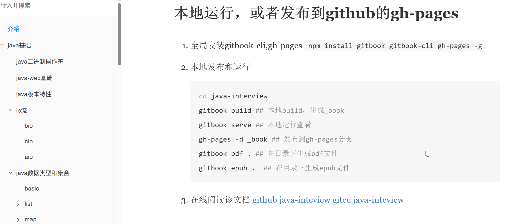
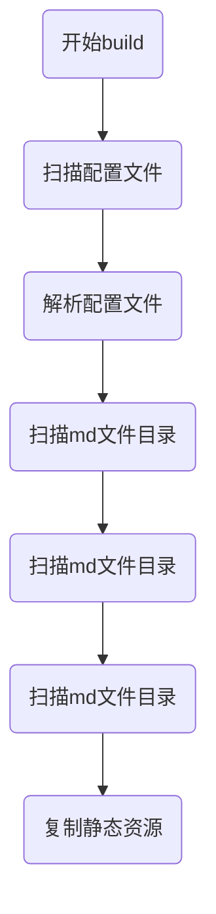
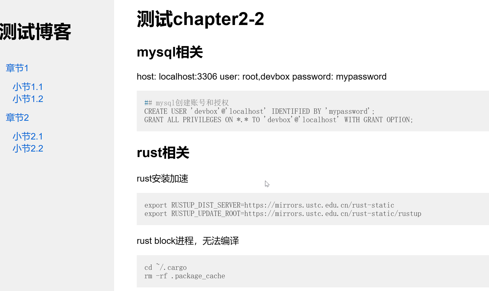

# rust-md-site-tool
这个静态博客的工具主要是把md文档转为html静态网站/博客。**github链接**：https://github.com/maochunguang/rust-md-site-tool

首先说明md文档转为静态网站/博客的原理，就是先做一个目录文档，叫做summary.md，然后其他文档都会链接到这个目录文档里。当把md文档转为html时，需要对链接进行处理，保证链接可以正常跳转，这样就完成了一个简单的md转静态博客工具。

## 第一步，设计博客工具
### 目录和样式设计
这个简易的博客/站点工具主要是模仿gitbook，可以认为是gitbook的简易版。页面布局也是gitbook一样，左边是目录，右边是内容。


首先需要定义一个博客的静态目录结构，如下图所示：
1. docs目录是所有md文档源文件；
2. static目录是所有静态文件的存放目录，比如js，css，image文件；
3. md_config.toml是全局配置文件，
4. summary.md是全局站点的目录；
5. index.md是全局首页内容
```
├── docs
│   ├── chapter1
│   │   ├── chapter1.html
│   │   ├── chapter1.md
│   ├── chapter2
│   │   ├── chapter2.html
│   │   ├── chapter2.md
│   ├── index.md
│   └── summary.md
├── md_config.toml
└── static
    ├── css
    │   └── style.css
    ├── images
    └── js
```
summary.md格式如下：

```md
* [章节1](chapter1/chapter1.md)
  * [小节1.1](chapter1/section1.1.md)
  * [小节1.2](chapter1/section1.2.md)
* [章节2](chapter2/chapter2.md)
  * [小节2.1](chapter2/section2.1.md)
  * [小节2.2](chapter2/section2.2.md)
```

配置文件结构如下：
```toml
title = "My Blog"
author = "Your Name"
description = "This is my blog."
port = 9900
static_dir = "static"
md_source_dir = "docs"
output_dir = ".site"
default_css_header = "<link rel=\"stylesheet\" href=\"./css/style.css\">"
default_code_header = "<link rel=\"stylesheet\" href=\"https://cdnjs.cloudflare.com/ajax/libs/highlight.js/11.3.1/styles/default.min.css\"><script src=\"https://cdnjs.cloudflare.com/ajax/libs/highlight.js/11.3.1/highlight.min.js\"></script>"
default_code_plugin = "<script>hljs.highlightAll();</script>"
```
### 功能实现和设计
本质上是一个命令行工具，依赖`clap=4.4.0`来创建，第一版支持三个命令：
1. `init`，初始化一些目录和配置文件
2. `build`，构建所有的文件，转为html到指定的输出目录
3. `run`，本地运行，在本地预览

由于要实现md文件转为html，需要借助依赖`pulldown-cmark = "0.9"`。

## 第二步，创建三个命令
创建main.js，把三个命令写出来：
```rust
fn main() {
    let matches = Command::new("rust-md-blog-tool")
        .version("1.0")
        .author("Your Name")
        .about("A simple static site generator")
        .subcommand(Command::new("init")
            .about("Initializes the blog with default configuration"))
        .subcommand(Command::new("build")
            .about("Builds the static site from markdown files"))
        .subcommand(Command::new("run")
            .about("Runs a local server to view the blog"))
        .get_matches();

    match matches.subcommand() {
        Some(("init", _)) => init_lib::init_command(),
        Some(("build", _)) => build_lib::build_command(),
        Some(("run", _)) => server_lib::run_command(),
        _ => println!("Invalid command or no command provided"),
    }
}
```
## 第三步实现init命令
init命令就是创建一个默认的配置文件，以及六个目录和一个css文件。
核心代码如下：
1. config_content是默认的配置文件内容，可以自定义字符串或者使用模板文件；
2. get_style_content是默认的css文件，可以自定义字符串或者使用模板文件；
3. 
```rust
    let _ = File::create("md_config.toml").and_then(|mut file| file.write_all(config_content.as_bytes()));

    // 创建所需的目录
    let _ = fs::create_dir_all("docs").map(|_| println!("created 'docs' Success"));
    let _ = fs::create_dir_all(".site").map(|_| println!("created '.site' Success"));
    let _ = fs::create_dir_all("static").map(|_| println!("created 'static' Success"));
    let _ = fs::create_dir_all("static/js").map(|_| println!("created 'static/js' Success"));
    let _ = fs::create_dir_all("static/css").map(|_| println!("created 'static/css' Success"));
    let _ = fs::create_dir_all("static/images").map(|_| println!("created 'static/images' Success"));
    let _ = File::create("static/css/style.css").and_then(|mut file| file.write_all(get_style_content().as_bytes())); 
    println!("Blog initialized with default configuration.");
```

## 第四步，实现build命令
构建所有的md文件流程也很简单：

核心代码如下：
```rust
pub fn build_command() {
    // ... 读取配置文件和设置目录 ...
    let config = fs::read_to_string("md_config.toml").expect("Unable to read config file");
    let parsed_config = config.parse::<Value>().expect("Unable to parse config");
    let source_dir =  parsed_config.get("md_source_dir").and_then(Value::as_str).unwrap_or("docs");
    // .....
    println!("load config source_dir :{}, output_dir:{}", source_dir, output_dir);
    let md_source_dir = Path::new(source_dir);
    let summary_path =format!("{}{}", source_dir, "/summary.md");

 
    // 解析 summary.md 并构建目录HTML
    let toc_html = build_toc_content(summary_path.clone());
    
    // 解析每个.md文件 转为HTML
    let md_files = read_dir_recursive(md_source_dir).expect("read md dir failed");

    // 为每个Markdown文件生成HTML页面
    for entry in md_files {
        let path = entry;
        if path.ends_with("summary.md"){
            continue;
        }
        let output_file_path = transform_path(&path, source_dir, output_dir);
        if path.extension().and_then(|s| s.to_str()) == Some("md") {
            let mut md_content = String::new();
            File::open(&path).and_then(|mut file| file.read_to_string(&mut md_content)).expect("Failed to read Markdown file");
            let parser = Parser::new(&md_content);
            let mut html_content = String::new();
            html::push_html(&mut html_content, parser);
            let _ = html_content.replace(".md", ".html");
            let output_file = output_file_path.with_extension("html");
            println!("output file:{}", output_file.as_path().display());
            let mut full_html;
            // 处理index页面逻辑
            full_html = format!("<html><head></head><body><div class=\"toc\">{}</div><div class=\"content\">{}</div></body></html>", toc_html, html_content);
            full_html = append_html(&full_html, "</head>", &[default_css_header, default_code_header]);
            // 增加highlight.js处理代码块
            full_html = append_html(&full_html, "</body>", &[default_code_plugin]);
            // 处理相对路径
            if contains_sub_dir(&output_file, output_dir){
                full_html = full_html.replace("./", "../").replace("<a href=\"", "<a href=\"../")
            }

            if let Some(parent) = output_file.parent() {
                // 创建所有必要的父文件夹
                fs::create_dir_all(parent).expect("create html parent dir failed");
            }
            fs::write(output_file, full_html).expect("Failed to write HTML file");
        }
    }

    // ... 复制静态资源 ...
    // 定义静态资源目录和目标目录
    let static_dir = Path::new(static_dir);
    let output_dir = Path::new(output_dir);

    // 复制静态资源
    if static_dir.exists() {
        copy_dir_all(static_dir, output_dir).expect("Failed to copy static files");
    }

    println!("Site built successfully.");
}
```
生成html文件这里需要注意几个点：
1. 第一个是文件路径，需要把html生成到配置的输出目录，需要一个path转换逻辑；
2. summary里面的链接需要处理，默认是`.md`，需要转为`.html`；
3. 所有链接的相对路径需要处理，根据目录都是用相对路径；
4. 复制静态资源时，也需要注意文件路径，以及文件夹是否存在。


## 第五步，实现run命令
这里由于只是本地运行查看html，所以选择tiny_http，启动一个简单的http服务。核心代码如下：
```rust
pub fn run_command() {
    // 读取配置文件
    let config = fs::read_to_string("md_config.toml").expect("Unable to read config file");
    let parsed_config = config.parse::<Value>().expect("Unable to parse config");
    let port = parsed_config.get("port").and_then(Value::as_str).unwrap_or("9900");
    let output_dir = parsed_config.get("output_dir").and_then(Value::as_str).unwrap_or(".site");
    let address = format!("0.0.0.0:{}", port);
    let server = Server::http(address).unwrap();
    println!("Running local server on port {}", port);

    for request in server.incoming_requests() {
        let url = if request.url() == "/" {
            "/index.html" // 使用 index.html 作为根路径的默认页面
        } else {
            request.url()
        };

        let file_path = PathBuf::from(output_dir).join(&url[1..]); // 移除 URL 的首个斜杠
        match fs::read(&file_path) {
            Ok(contents) => {
                let response = Response::from_data(contents).with_header(
                    Header::from_bytes("Content-Type", "text/html; charset=utf-8").unwrap(),
                );
                request.respond(response).unwrap();
            }
            Err(_) => {
                let response = Response::from_string("Not Found").with_status_code(404);
                request.respond(response).unwrap();
            }
        }
    }
}
```
这里需要注意的是，直接返回html会中文乱码，所以统一都加了`Content-Type", "text/html; charset=utf-8`。

## 第六步，展示成果
新建一个用于测试的博客目录：
1. 在博客工具目录执行`cargo run`生成执行的命令文件;
2. 复制博客工具命令，`cp target/debug/rust_md_site_tool ~/.cargo/bin`;
3. 执行 `rust_md_site_tool init`初始化博客；
4. 在docs目录新建`summary.md`和`index.md`，并在summary里创建好测试的md文档和链接;
5. `rust_md_site_tool build`构建目录;
6. 打开浏览器 http://localhost:9900/ ;可以访问index.html;


